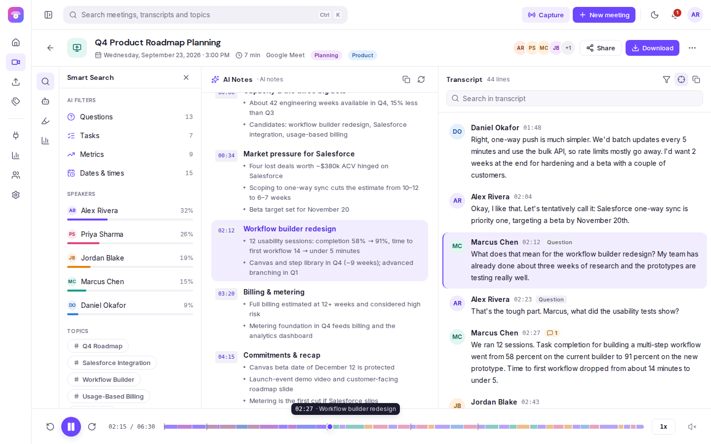
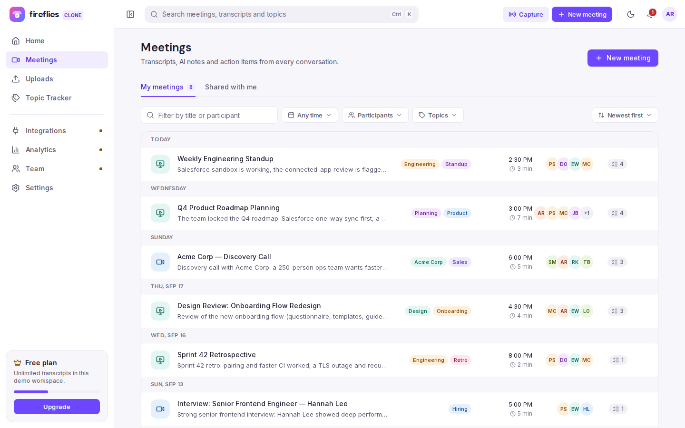
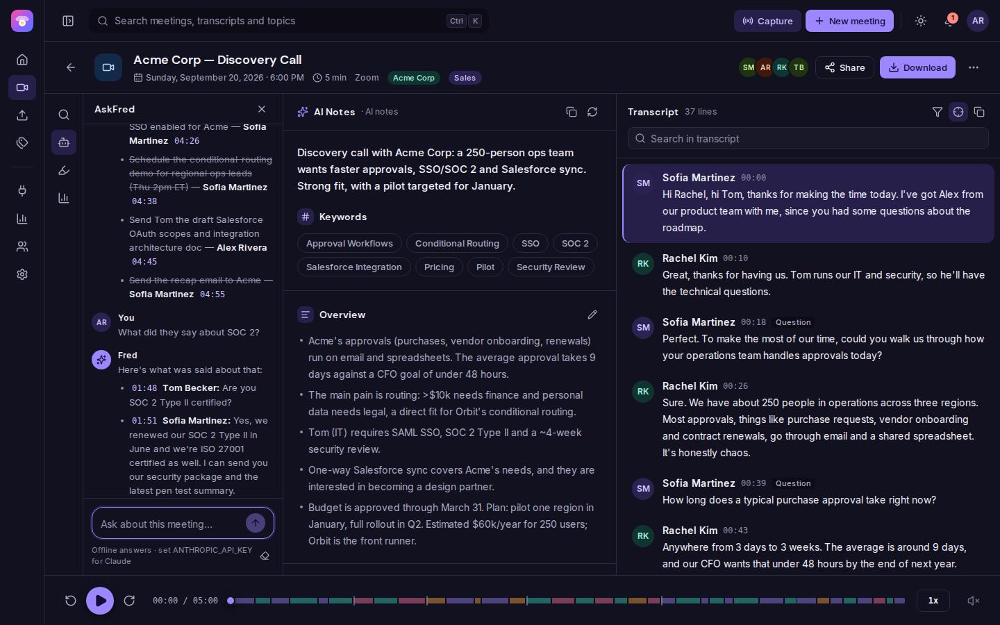
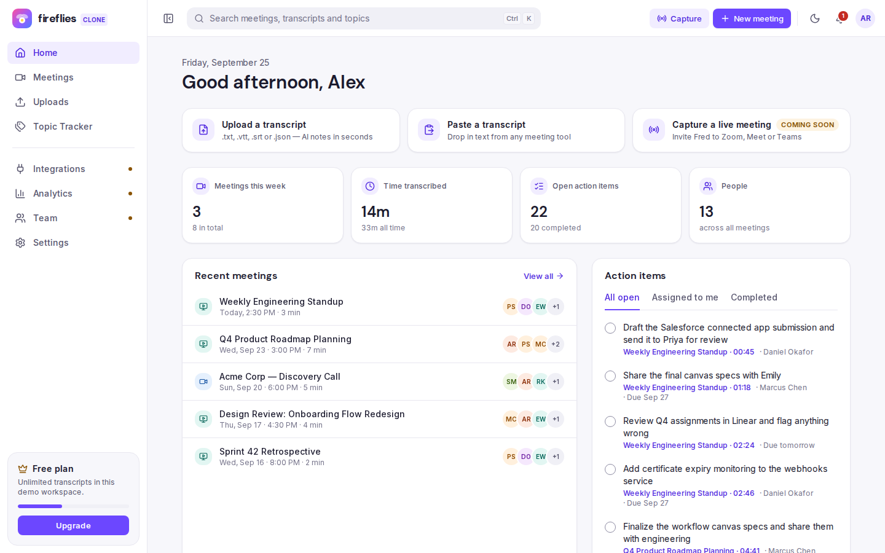
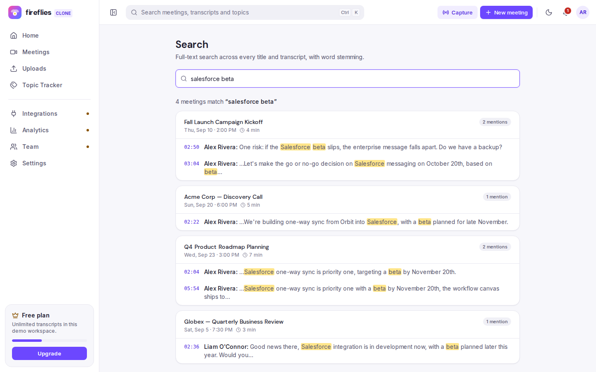
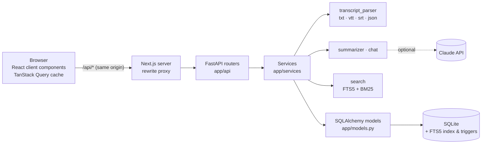
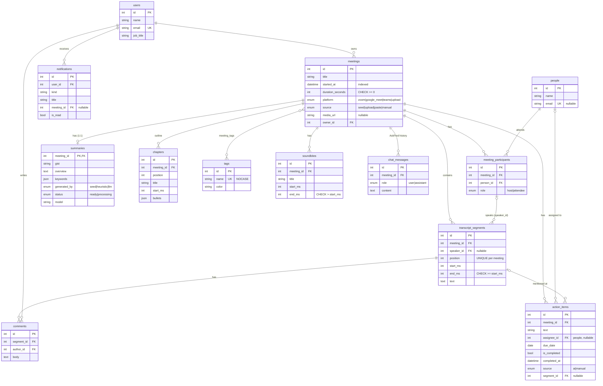

# Fireflies.ai Clone — meeting notes & transcripts

A full-stack clone of the [Fireflies.ai](https://fireflies.ai) meeting assistant: a meetings library, an
interactive transcript synced to a media player, AI-generated notes (summary, outline, action items),
AskFred chat, full-text search across every meeting, and full CRUD — built with **Next.js 16 + TypeScript**,
**FastAPI** and **SQLite**.



| Meetings library | AskFred (dark mode) |
| --- | --- |
|  |  |
| **Home dashboard** | **Global search** |
|  |  |

---

## Contents

- [Features](#features)
- [Tech stack](#tech-stack)
- [Quick start](#quick-start)
- [Architecture](#architecture)
- [Database schema](#database-schema)
- [API overview](#api-overview)
- [How the AI notes work](#how-the-ai-notes-work)
- [Deployment](#deployment)
- [Project structure](#project-structure)
- [Assumptions & limitations](#assumptions--limitations)

---

## Features

### Core (all required features)

| Area | What's implemented |
| --- | --- |
| **Meetings library** | List with title, date/time, duration, participants, tags, gist and open action items; grouped by day (Today / Yesterday / weekday / date). Filter by title **or participant name**, date range (presets + custom), participants (multi-select), topics; sort newest/oldest/longest/shortest/A–Z; "Load more" pagination. Filters live in the URL, so filtered views can be shared. |
| **Navbar** | Sidebar (Home, Meetings, Uploads, Topic Tracker, Integrations, Analytics, Team, Settings), top bar with global search (<kbd>Ctrl/⌘ K</kbd>), Capture, New meeting, dark-mode toggle, notifications and a profile menu. |
| **Transcript view** | Speaker avatars, names and timestamps. **Clicking a line seeks the player**; **playback highlights the active line and auto-scrolls** (pauses when you scroll; "Resume auto-scroll" brings it back). Search within the transcript highlights every match, with a match counter and previous/next navigation. |
| **Media player** | A bottom player with play/pause, ±15 s, speed (1×–2×), keyboard shortcuts (<kbd>Space</kbd>, <kbd>←</kbd>/<kbd>→</kbd>) and a seek bar that shows **who is speaking when**, plus chapter markers and hover previews. Uses a real `<audio>` element when a meeting has a recording URL, otherwise a simulated clock. |
| **AI summary & notes** | Gist, keywords, overview bullets, **outline/chapters with timestamps** (click to jump; the current chapter is highlighted) and **action items grouped by assignee**. Regenerate or edit the notes. |
| **CRUD** | Create a meeting by **uploading** a `.txt/.vtt/.srt/.json` transcript, **pasting** text, or a **manual form**. Edit the title, date, platform, participants, tags and recording URL. Delete a meeting (cascades to everything it owns). Add, edit, assign, set a due date on, complete and delete action items. Everything persists in SQLite. |
| **Fireflies experience** | Fireflies-style layout (library, and a meeting page with a tool rail, notes and transcript), violet palette, modals, menus, tooltips, toasts, empty states, loading skeletons, and "Coming soon" placeholders for out-of-scope features. |

### Bonus features (all implemented)

- **Comments** on any transcript line, **soundbites** (saved clips you can replay), and quick "create action item from this line".
- **Export**: notes + transcript as **PDF** or **Markdown**, notes only, transcript as **TXT** or **SRT** captions.
- **Global search** across all transcripts (SQLite FTS5 with Porter stemming, ranked by BM25, highlighted snippets that deep-link to the exact moment).
- **Tags / topics** with filtering, and a Topic Tracker page.
- **AskFred** chat per meeting: answers from Claude when an API key is set, or from an offline answerer. Citations like `[04:12]` are clickable.
- **Dark mode** (light / dark / system, no flash on load).
- Extras: **Smart Search** filters (questions, tasks, metrics, dates & times, per speaker), **speaker analytics** (talk-time %, words per minute, questions, longest monologue), editable transcript text and speaker reassignment, a home dashboard with a cross-meeting task list, notifications, sample transcript downloads, and a responsive mobile layout.

### Placeholders ("Coming soon")

Live meeting bot (Capture), speech-to-text for audio/video uploads, integrations (Zoom, Meet, Teams,
calendars, Salesforce, HubSpot, Slack, Notion), team sharing, workspace analytics, billing and
authentication (a default user is always signed in).

---

## Tech stack

| Layer | Choices |
| --- | --- |
| Frontend | Next.js 16 (App Router, Turbopack), React 19, TypeScript, Tailwind CSS v4, TanStack Query, Radix UI primitives, Sonner toasts, lucide icons, date-fns |
| Backend | Python 3.12, FastAPI, SQLAlchemy 2.1 (typed ORM), Pydantic v2, Uvicorn |
| Database | SQLite with enforced foreign keys and an **FTS5** full-text index |
| AI (optional) | Anthropic Claude via the official `anthropic` SDK (structured JSON output for the notes, prompt caching for chat) |
| Exports | fpdf2 (PDF), plain Markdown / text / SRT |
| Tests | pytest + FastAPI TestClient (26 tests) |

---

## Quick start

**Prerequisites:** Python 3.11+ and Node.js 20+.

### 1. Backend (FastAPI on :8000)

```bash
cd backend
python3 -m venv .venv
source .venv/bin/activate          # Windows: .venv\Scripts\activate
pip install -r requirements.txt
uvicorn app.main:app --reload --port 8000
```

On first start, the database (`backend/fireflies.db`) is created and seeded with **8 demo meetings**
that include full transcripts, notes, action items, comments and soundbites. Interactive API docs
are at <http://localhost:8000/docs>.

```bash
python -m app.seed.seed --reset    # wipe and reseed the demo data
python -m pytest                   # run the test suite
```

### 2. Frontend (Next.js on :3000)

```bash
cd frontend
npm install
npm run dev                        # BACKEND_URL defaults to http://127.0.0.1:8000
```

Open <http://localhost:3000>.

### Optional: Claude-powered notes and AskFred

```bash
export ANTHROPIC_API_KEY=sk-ant-...   # or put it in backend/.env (see backend/.env.example)
export LLM_MODEL=claude-opus-5        # optional, this is the default
```

Without a key, everything works using the offline heuristics described [below](#how-the-ai-notes-work).

---

## Architecture



**Backend layering.** Routers only translate HTTP to and from Pydantic schemas. Services hold the
logic and raise domain errors (`NotFoundError` → 404, `ConflictError` → 409, `InvalidInputError` →
422), which one exception handler maps to responses. Models define the schema and constraints. The
AI layer (`summarizer.py`, `chat.py`) has an LLM path and an offline path that return the same data
shape, so persistence doesn't care which one ran.

**Frontend.** The browser only talks to `/api/*` on its own origin, and Next.js proxies that to FastAPI,
so there's no CORS setup and the backend URL isn't exposed. Server state lives in TanStack Query
(`src/lib/queries.ts`). Mutations invalidate exactly the affected caches, and ticking an action
item is optimistic. The meeting page shares one **player store** (`src/lib/player.ts`, an external
store read through `useSyncExternalStore`). The clock runs at 60 fps, but each component subscribes
to one slice, so the transcript only re-renders when the *active line* changes, not on every frame.
Transcript lines are memoised.

**Design system.** Colours, radii, shadows and motion are CSS custom properties in
`src/app/globals.css` (surface/ink/accent tokens with light and dark values), exposed to Tailwind as
utilities (`bg-surface`, `text-ink-muted`, `bg-accent`…). Components never hand-type colours. Motion
follows a small rulebook: press feedback is `scale(.97)`; dialogs scale from `.96`; menus open from
their trigger; the first tooltip is delayed and later ones open instantly; nothing animates on
keyboard actions; and every animation has a reduced-motion variant.

---

## Database schema



Plus the association table `meeting_tags (meeting_id, tag_id)` and the full-text index
`transcript_segments_fts`.

**Design decisions**

- **`people` vs `meeting_participants`.** A person (a colleague or a customer) exists once and joins
  many meetings through `meeting_participants`, which also stores their **role** in that meeting.
  This is what makes "filter meetings by participant" a simple indexed join, and it lets the same
  person be an assignee across meetings.
- **Speakers are participants.** `transcript_segments.speaker_id` references
  `meeting_participants.id`, not a free-text name. Renaming or reassigning a speaker is a single
  update, speaker analytics are a `GROUP BY`, and the API refuses (409) to remove a participant who
  speaks in the transcript.
- **Cascades mirror ownership.** Deleting a meeting removes its participants, segments, summary,
  chapters, action items, soundbites, chat and comments (`ON DELETE CASCADE`). Optional links use
  `SET NULL` (an action item's assignee or source segment, a notification's meeting).
  `PRAGMA foreign_keys=ON` is set on every connection, because SQLite leaves it off by default.
- **Integrity in the database, not just the app:** `CHECK` constraints on time ranges and durations,
  `UNIQUE(meeting_id, position)` for transcript order, `UNIQUE(meeting_id, person_id)` for
  attendance, case-insensitive unique tag names (`COLLATE NOCASE`), and enums stored as strings with
  `CHECK` constraints (readable in raw SQL).
- **Full-text search.** `transcript_segments_fts` is an FTS5 *external-content* table (Porter
  stemming) over `transcript_segments.text`. `AFTER INSERT/UPDATE/DELETE` triggers keep it in
  sync, and those triggers also fire on cascaded deletes, which a test covers. Queries use BM25
  ranking and `snippet()`. User input is tokenised and quoted before it reaches `MATCH`, and snippets
  are HTML-escaped before `<mark>` tags are added.
- **JSON where it's a value, not an entity.** `summaries.keywords` and `chapters.bullets` are ordered
  lists that are always read and written whole, so they're JSON columns. Action items are queried
  and updated on their own, so they're a table.
- **Times.** Timestamps are stored as naive UTC and returned as timezone-aware UTC (a small
  `TypeDecorator`). Transcript offsets are integer milliseconds.
- Indexes cover the hot paths: `meetings.started_at`, `(meeting_id, start_ms)` on segments,
  `(meeting_id, position)` on action items, and the foreign keys used in filters.

---

## API overview

All routes are under `/api`. Full request/response schemas are at `/docs` (OpenAPI).

| Method | Path | Purpose |
| --- | --- | --- |
| GET | `/meetings` | List meetings. Query: `q` (title or participant), `person_id` (repeatable, all must attend), `tag_id` (repeatable), `date_from`, `date_to`, `sort=newest\|oldest\|longest\|shortest\|title`, `page`, `page_size` |
| POST | `/meetings` | Create from a form; include `transcript_text` to paste a transcript |
| POST | `/meetings/upload` | Multipart upload of `.txt/.vtt/.srt/.json` plus optional title, date, participants and tags |
| GET / PATCH / DELETE | `/meetings/{id}` | Detail (notes, chapters, action items, speaker stats) / update metadata and participants / delete |
| POST | `/meetings/{id}/summary/regenerate` | Rebuild the AI notes (runs in the background when Claude is enabled) |
| PATCH | `/meetings/{id}/summary` | Edit gist, overview or keywords |
| GET | `/meetings/{id}/export?format=pdf\|md\|txt\|srt&content=full\|summary\|transcript` | Download |
| GET | `/meetings/{id}/transcript` | Segments with speaker and Smart Search flags |
| PATCH | `/meetings/{id}/transcript/{segment_id}` | Fix text or reassign the speaker |
| GET / POST | `/meetings/{id}/comments` · DELETE `/comments/{id}` | Comments on transcript lines |
| GET / POST | `/meetings/{id}/soundbites` · DELETE `/soundbites/{id}` | Saved clips |
| GET | `/action-items?completed=&assignee_id=` | Action items across all meetings |
| POST | `/meetings/{id}/action-items` · PATCH / DELETE `/action-items/{id}` | Action item CRUD (completing one sets `completed_at`) |
| GET / POST / DELETE | `/meetings/{id}/chat` | AskFred history / ask a question / clear |
| GET | `/search?q=` | Full-text search across titles and transcripts |
| GET / PATCH | `/me` | Default user profile |
| GET | `/people`, `/tags`, `/stats`, `/notifications` · POST `/notifications/read-all` | Directory, dashboard numbers, notifications |
| GET | `/health` | Liveness, and whether Claude is configured |

Errors always look like `{"detail": "..."}`, with 404 for missing resources, 409 for conflicts (e.g.
removing a speaking participant), 413 for oversized uploads and 422 for validation errors.

---

## How the AI notes work

Real speech-to-text is out of scope, so the pipeline starts from transcript text.

1. **Parsing** (`services/transcript_parser.py`). Detects the format; extracts speakers from `Name:`
   prefixes or WebVTT `<v Name>` tags; parses timestamps; merges caption cues split mid-sentence; and
   estimates timings from word counts (~2.6 words/s) when a file has none. Speakers become
   participants automatically.
2. **Instant offline notes** (`services/text_analysis.py`, `summarizer.py`), with no external calls:
   - *keywords*: frequent content words and two-word phrases, stopwords and names excluded, keeping
     the transcript's casing ("Salesforce", "OAuth");
   - *overview*: an opener plus the highest-scoring sentences (term-frequency ranking);
   - *chapters*: time-based sections titled by the keywords most concentrated in each;
   - *action items*: commitments ("I'll send…"), direct requests ("Grace, can you…") and team tasks
     ("we need to…"), with the owner inferred and pronouns rewritten ("send you" → "send them");
   - *Smart Search flags*: questions, metrics, dates and times, and lines linked to tasks.
3. **Claude upgrade** (when `ANTHROPIC_API_KEY` is set). After an upload, the meeting shows offline
   notes immediately with `status: processing`. A background task then asks Claude for the notes
   using a strict JSON schema (structured outputs) and swaps them in; the UI polls until they're
   ready. Regenerating replaces only **open, AI-suggested** action items, so items you added, edited
   or completed are kept.
4. **AskFred** sends the question, the recent chat history and the transcript to Claude; the
   transcript is prompt-cached across turns. Offline, an intent-based answerer handles summaries,
   action items, decisions, questions and talk time, and otherwise quotes the best-matching lines.
   Both cite `[mm:ss]` timestamps, which the UI turns into player links.

The 8 seeded meetings ship with hand-written notes (`generated_by: "seed"`), so the demo looks right
without a key. Upload one of the sample files on the **Uploads** page to see the offline pipeline.

---

## Deployment

The repository includes a **Render Blueprint** (`render.yaml`) and a backend `Dockerfile`.

**Render (both services)**

1. Push the repo to GitHub, then in Render go to **New → Blueprint** and select it.
2. Deploy. When `fireflies-clone-api` is live, copy its URL (e.g. `https://fireflies-clone-api.onrender.com`).
3. Set `BACKEND_URL` on `fireflies-clone-web` to that URL and redeploy it. `BACKEND_URL` is read at
   build time, when Next.js resolves its rewrites.
4. Optionally set `ANTHROPIC_API_KEY` on the API service.

**Vercel (frontend) + Render/Railway (API).** Import the repo in Vercel with **Root Directory =
`frontend`** and set `BACKEND_URL` to your API URL. Deploy `backend/` to Render (Python,
`uvicorn app.main:app --host 0.0.0.0 --port $PORT`) or to Railway/Fly with the Dockerfile.

> **Persistence note:** free hosting tiers use ephemeral disks, so the SQLite file is reset on
> restart and the app **re-seeds the demo data automatically** (`SEED_ON_STARTUP=true`). For durable
> data, mount a disk or volume and point `DATABASE_URL` at it, e.g. `sqlite:////data/fireflies.db`,
> which is what the Dockerfile does.

---

## Project structure

```
backend/
  app/
    main.py              app factory, CORS, error handler, startup seeding
    config.py            settings from environment (.env supported)
    database.py          engine, sessions, SQLite pragmas, FTS5 table + triggers
    models.py            SQLAlchemy models (the schema)
    errors.py            domain errors → HTTP status
    schemas/             Pydantic request/response models
    api/                 routers: meetings, transcript, action_items, chat, workspace
    services/            meetings, transcript, action_items, search, chat, export, stats,
                         transcript_parser, text_analysis, summarizer, llm, directory
    seed/                demo workspace (data.py) and loader (seed.py)
  tests/                 API, parser and heuristics tests
frontend/
  src/app/               routes: / · /meetings · /meetings/[id] · /search · /uploads · /topics
                         · /settings · /integrations · /analytics · /team
  src/components/
    ui/                  design-system primitives (button, dialog, menu, tooltip, chips, fields…)
    layout/              app shell, sidebar, top bar, global search, menus
    meetings/            library, filters, rows, create/edit dialogs
    meeting/             meeting page: header, notes, action items, transcript, player, side panels
    home/ search/ uploads/ settings/ placeholders/
  src/lib/               API client, types, queries, player store, theme, preferences, formatters
  public/samples/        sample transcripts in every supported format
render.yaml              Render Blueprint
```

---

## Assumptions & limitations

- **Single user, no auth.** The first user row is the signed-in user ("Alex Rivera"); the profile is
  editable in Settings. Sharing, teams and permissions are placeholders.
- **No audio processing.** Audio/video uploads are recognised and politely declined with a "coming
  soon" message. Playback is simulated unless a meeting has a recording URL (set it in *Edit
  details*), in which case a real `<audio>` element drives the same player.
- **Seed timings are realistic, so meetings are short.** Seeded transcripts are condensed
  conversations timed at natural speech rate (~150 wpm), so durations are 2–9 minutes rather than a
  full hour.
- **Offline AI is heuristic.** It's good at action items and keywords but less fluent than an LLM.
  Adding an Anthropic key upgrades notes and AskFred with no other changes.
- **Branding.** This is an educational clone: the logo mark is original, and the name "Fireflies" and
  the assistant "Fred" are used only to mirror the product being cloned.
- **Browser-local preferences** (theme, playback speed, auto-scroll, notification toggles) live in
  `localStorage`; everything else persists in the database.
